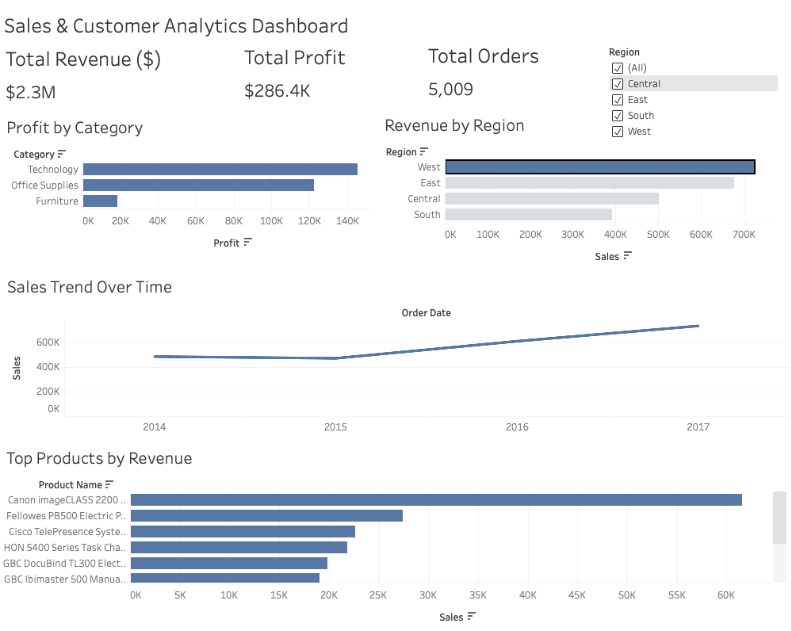

# Sales & Customer Analytics Dashboard

## Overview

This project analyzes sales and customer performance data using SQL, PostgreSQL, and Tableau Public.

The dashboard provides interactive business insights into:

- Revenue performance
- Profitability
- Regional sales distribution
- Product performance
- Sales trends over time

The project simulates a real-world Business Intelligence workflow:

```text
CSV Data → PostgreSQL → SQL Analysis → Tableau Dashboard
```

---

# Dashboard Preview



---

# Tableau Dashboard

## Live Dashboard

https://public.tableau.com/app/profile/niklas.rineisen/viz/SalesCustomerAnalyticsDashboard_17788816846190/SalesCustomerAnalyticsDashboard

---

# Tech Stack

- PostgreSQL
- SQL
- Tableau Public
- CSV Data Analysis
- Git & GitHub

---

# Features

- Interactive KPI dashboard
- Revenue analysis
- Profit analysis
- Regional sales analysis
- Product performance tracking
- Sales trend visualization
- Interactive region filtering
- Business insights reporting

---

# Key Insights

- The West region generated the highest revenue.
- Technology products produced the highest total profit.
- Revenue increased significantly from 2015 to 2017.
- A small number of products generated a disproportionate share of revenue.
- Office Supplies and Technology were the strongest-performing categories.

---

# Dashboard KPIs

- Total Revenue
- Total Profit
- Total Orders

---

# Dashboard Components

## Revenue by Region
Visualizes sales performance across geographic regions.

## Profit by Category
Shows profitability across product categories.

## Sales Trend Over Time
Displays revenue growth trends between 2014 and 2017.

## Top Products by Revenue
Highlights the highest-performing products by sales.

---

# SQL Analysis Examples

## Total Revenue

```sql
SELECT ROUND(SUM("Sales"), 2) AS total_revenue
FROM superstore;
```

## Total Profit

```sql
SELECT ROUND(SUM("Profit"), 2) AS total_profit
FROM superstore;
```

## Revenue by Region

```sql
SELECT "Region",
       ROUND(SUM("Sales"), 2) AS revenue
FROM superstore
GROUP BY "Region"
ORDER BY revenue DESC;
```

## Top Products by Revenue

```sql
SELECT "Product Name",
       ROUND(SUM("Sales"), 2) AS revenue
FROM superstore
GROUP BY "Product Name"
ORDER BY revenue DESC
LIMIT 10;
```

---

# Project Structure

```text
sales-customer-analytics-dashboard/
│
├── data/
├── docs/
│   └── dashboard.png
├── sql/
├── README.md
```

---

# Business Intelligence Workflow

1. Imported CSV sales data into PostgreSQL
2. Created analytical SQL queries
3. Explored revenue and profitability metrics
4. Built an interactive Tableau dashboard
5. Published the dashboard to Tableau Public

---

# Future Improvements

- Live PostgreSQL connection with Tableau
- Advanced KPI calculations
- Customer segmentation analysis
- Forecasting and predictive analytics
- Additional interactive dashboard filters
- Automated ETL pipeline

---

# Author

Niklas Ringeisen